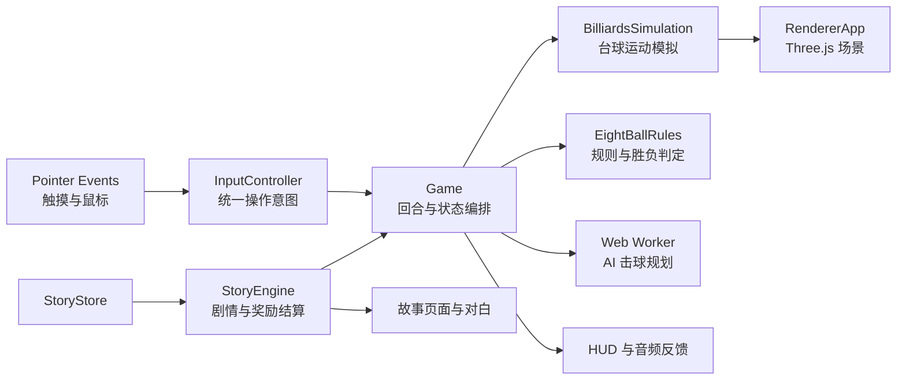

# Lucky Break Mobile 技术与构建说明

本文对应当前公开版本 **v1.1.0**，介绍游戏实际采用的运行技术、系统分层和发布方式。公开仓库保存经过验证的静态发布产物；TypeScript 开发源码、编辑工具和原始素材备份不包含在公开站点中。

## 技术栈

| 范围 | 技术 | 用途 |
| --- | --- | --- |
| 开发语言 | TypeScript 5.5、原生 ES Modules | 游戏状态、规则、剧情、输入、渲染和 UI 逻辑 |
| 构建工具 | Vite 5.4 | 开发服务器、模块打包、资源哈希和生产构建 |
| 3D 渲染 | Three.js 0.166 | 球桌、球、球杆、场景、镜头、材质、灯光和特效 |
| 训练关卡物理 | Rapier 3D 0.20 | 啤酒罐训练中的刚体、凸包碰撞、连续碰撞检测和接触事件 |
| 几何加速 | three-mesh-bvh、three-bvh-csg | 复杂网格查询及几何处理支持 |
| 音频 | Web Audio API、采样音频、jsfxr | 击球、碰撞、入袋、环境反馈、UI 音效和背景音乐 |
| 玩家界面 | 原生 DOM、CSS、Pointer Events | HUD、菜单、剧情阅读、触摸操作和安全区适配 |
| 自动验证 | Playwright、Chromium CDP 触摸模拟 | 多尺寸界面、触摸取消、主要玩家路径和发布资源检查 |
| 静态托管 | GitHub Pages、GitHub Actions | 自动部署可独立运行的生产站点 |

项目没有引入 React、Vue 等 UI 框架。游戏状态由 TypeScript 模块管理，界面使用 DOM 与 CSS 渲染，3D 内容由独立的 Three.js Canvas 呈现。

## 运行架构



输入控制器只提交瞄准、击点、抬杆和出杆等游戏意图。`Game` 负责回合、暂停、规则、AI、镜头和表现层之间的协调，物理状态与 DOM 展示不会互相复制规则。

## 台球模拟与 AI

标准台球使用项目自己的 `BilliardsSimulation`。模拟包含球与球、库边和球袋碰撞，以及滚动阻力、旋转、扎杆、跳球、击点和球杆仰角等参数。滚动阶段通过固定模拟时钟分步推进，并把碰撞、入袋等事件交给画面和音频系统表现。

八球合法目标、犯规、球权和胜负由独立的 `EightBallRules` 处理。AI 规划由 `PoolAI.worker.ts` 放入 Web Worker，在主线程之外计算候选击球，减少规划过程对渲染和触摸响应的阻塞。

Rapier 3D 用于啤酒罐训练关卡，而不是替代标准台球模拟。该关卡以 1/120 秒步长运行，使用动态刚体、球形与凸包碰撞体、连续碰撞检测和接触力事件，支持罐体翻滚、碰撞、损伤及掉出台外判定。

## 渲染与资产

`RendererApp` 统一管理 WebGLRenderer、场景、相机、灯光和逐帧同步。球桌使用 GLB 模型，公共目录提供 Draco 解码器、字体、纹理和运行音频；球、球杆、袋口、开球硬币、啤酒罐和部分特效由独立渲染模块组合。

剧情场景同时支持全景背景、人物立绘和 DOM 对话层。移动版 v1.1.0 让台球 Canvas 与故事卧室背景铺满横屏视口，状态和操作以悬浮 HUD 覆盖在场景上，不再用界面分栏缩小主要画面。

资源在开发阶段只读引用原项目的美术、模型、音乐和公共资源，不维护第二份素材源。生产构建会把实际引用的资源收集进 `dist`，因此发布站点不依赖原开发服务器。此前针对 85 张超过 2 MB 的源图片进行了压缩，生产包中没有超过 2 MB 的图片。

## 剧情、存档与玩家功能

剧情系统由 `StoryEngine`、`StoryStore` 和数据目录组成。引擎处理日期、精力、金钱、声望、NPC 日程与关系、任务、随机事件、比赛奖励、商店、工坊和月赛等状态；界面根据真实进度显示入口和选项。

移动版使用独立的 `luckybreak.mobile.v1.*` Local Storage 前缀，不读取或覆盖原 Web 版存档。存档继续使用 `billiards-story-save` version 1 JSON 格式，玩家可以手动导入、导出。公开站点没有玩家数据写入服务，存档保存在当前浏览器本地。

## 移动输入与界面

移动版固定使用真实视口和横屏布局，支持刘海与圆角安全区。普通正文为 16 px，剧情默认 18 px并可切换 16/18/20 px；主要触控区域至少为 48×48 CSS 像素。

对局采用球桌拖动粗瞄、边缘区域微调、下拉蓄力和前推击球。输入控制器只允许一个活动指针拥有当前手势；第二根手指不能接管或提交出杆。`pointercancel`、失去指针捕获、切后台、失焦、旋转、暂停和显式取消都会清空当前手势。左右手设置会镜像力度与微调区域，但不会改变全屏画布范围。

## 构建与发布特色

移动版是原项目旁边的独立玩家构建，拥有自己的 `package.json`、锁文件、TypeScript/Vite 配置、HTML 入口和 `dist`。构建过程为：

```text
TypeScript 类型检查
        ↓
Vite 生产打包与资源哈希
        ↓
玩家功能边界检查
        ↓
GitHub Pages 子路径重写
        ↓
GitHub Actions 自动部署
```

开发端口固定为 5199，端口冲突会直接报错；生产预览使用 5200。Vite 中的玩家边界会拒绝故事编辑器、资产查看器、音频制作器和球桌校准器入口，也拒绝非读取型开发接口。生产输出只包含游玩所需页面和资源。

GitHub Pages 发布前，脚本将根路径资源重写到 `/luckybreak-mobile-v1/`，再对发布目录执行逐文件可访问检查。当前 v1.1.0 发布副本包含 393 个文件，共 275,512,487 字节，约 262.75 MiB。

## 验证范围

自动验证覆盖 844×390、667×375、568×320 三种横屏视口，包括：

- 全视口 Canvas、悬浮 HUD、故事主页入口和 48 px 命中区；
- 正常出杆只提交一次，以及九类取消各连续 20 次不出杆；
- 第二指、左右手、横竖屏切换、剧情长选项和滚动防误选；
- 新档、存档导入、球馆 NPC 主线激活、比赛结算返回及主要玩家页面；
- 生产资源完整性、编辑端点隔离和 GitHub Pages 公网访问。

这些结果来自 Chromium 的浏览器触摸模拟。iOS 和 Android 真机上的系统手势、持续帧率、音频解锁与首访加载时间仍需单独记录。

## 当前发布

- 在线游玩：https://giogyan90.github.io/luckybreak-mobile-v1/
- 版本：v1.1.0
- 发布提交：`bd1cfb9`
- 部署方式：GitHub Actions → GitHub Pages
